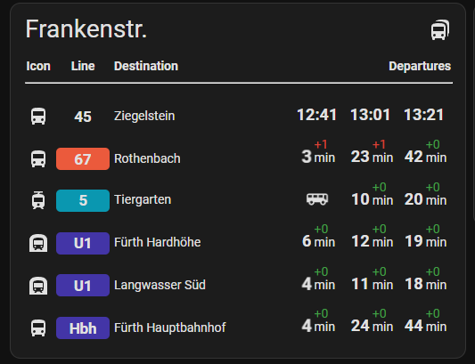
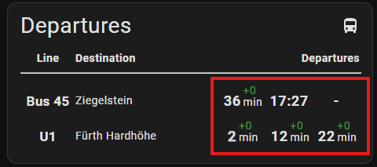
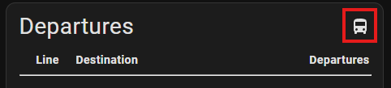
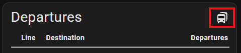
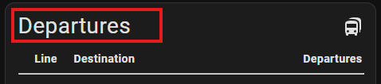
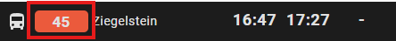
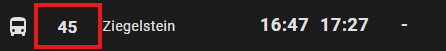
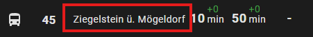

# Departures Card


A card to display departure times provided by [Departures](https://github.com/alex-jung/ha-departures) custom integration.

<p align="center">
  
</p>

## Installation

#### Manual

1. Download from last release `dist/ha-departures-car.js` file.
2. Activate Home Assistant `advanced mode` (Profile -> Advanced mode)
3. Open `settings -> Dashboards` and click on tree dots in right upper corner
4. Click on `Ressourcen` and then on `Add Ressource` button
5. Add `local/ha-departures-card.js` as JS module
6. Refresh the page

#### HACS (recommended)

1. Open `HACS`
2. Add this repository as a custom repository (HACS -> Custom repositories, type "Dashboard")
3. Search for `Departures Card` integration and download it.
4. Add a new card to the dashboard

## Card Properties

| yaml attribute                                            | Type         | Required | Default value                                         |
| --------------------------------------------------------- | ------------ | -------- | ----------------------------------------------------- |
| type                                                      | string       | yes      | `custom:departures-card`                              |
| [animateLine](#animateLine)                               | boolean      | no       | false                                                 |
| [arrivalTimeOffset](#arrivalTimeOffset)                   | number       | no       | 0                                                     |
| [cardOrientation](#cardOrientation)                       | string       | yes      | "vertical"                                            |
| [departureAnimation](#departureAnimation)                 | string       | no       | "none"                                                |
| [departureAnimationDuration](#departureAnimationDuration) | number       | no       | default value                                         |
| [departureIcon](#departureIcon)                           | string       | no       | -                                                     |
| [departuresToShow](#departuresToShow)                     | number       | no       | 5                                                     |
| entities                                                  | entity[]     | yes      | -                                                     |
| [icon](#icon)                                             | string       | no       | "mdi:bus-multiple"                                    |
| [layout](#layout)                                         | list[string] | yes      | ["icon", "line", "destination", "time-diff", "delay"] |
| [scrollBackTimeout](#scrollBackTimeout)                   | number       | no       | 5                                                     |
| [showCardHeader](#showCardHeader)                         | boolean      | no       | true                                                  |
| [showListHeader](#showListHeader)                         | boolean      | no       | true                                                  |
| [showScrollButtons](#showScrollButtons)                   | boolean      | no       | true                                                  |
| [sortDepartures](#sortDepartures)                         | boolean      | no       | true                                                  |
| [theme](#theme)                                           | string       | no       | "Basic"                                               |
| [title](#title)                                           | string       | no       | "Departures"                                          |

### "animateLine"

**Type:** `boolean`
**Default:** `false`

Controls how arrival animations are applied to a row.

- When `true`, the **entire departure row** is animated when new data arrives.
- When `false`, **only the time cell** of the arrival row is animated.

Use this option to emphasize full row updates or keep animations subtle by limiting them to the time column.

```yaml
type: custom:departures-card
animateLine: true
```

| animateLine: true                    | animateLine: false                    |
| ------------------------------------ | ------------------------------------- |
|  |  |

### "arrivalTimeOffset"

**Type:** `number`
**Unit:** minutes
**Default:** `0`

Defines how many minutes **before the scheduled arrival time** the arrival animation should start.

For example, if `arrivalTimeOffset` is set to `5`, the arrival animation will begin **5 minutes before arrival**.

Use this option to control how early upcoming arrivals are visually highlighted.

```yaml
type: custom:departures-card
arrivalTimeOffset: true
```

| arrivalTimeOffset:0                     | arrivalTimeOffset:2                     |
| --------------------------------------- | --------------------------------------- |
|  |  |

### "cardOrientation"

**Type:** `string`  
**Allowed values:** `"vertical"`, `"horizontal"`  
**Default:** `"vertical"`

Defines how arrivals are displayed.

- `"vertical"`: Arrivals are shown in a **scrollable list**.
- `"horizontal"`: Arrivals are displayed in a **table layout**.

Use this option to choose the layout that best fits your screen size and use case.

```yaml
type: custom:departures-card
cardOrientation: "vertical"
```

| cardOrientation: "vertical"                  | cardOrientation: "horizontal"                  |
| -------------------------------------------- | ---------------------------------------------- |
|  |  |

### "departureAnimation"

**Type:** `string`
**Default:** `"none"`

Defines which animation is triggered when a **departure event occurs**.

This option allows you to customize how departures are visually indicated, for example to draw attention to changes or upcoming departures.

```yaml
type: custom:departures-card
departureAnimation: "vertical"
```

| departureAnimation:                         | departureAnimation: "flash"                  |
| ------------------------------------------- | -------------------------------------------- |
|  |  |

### "departureAnimationDuration"

**Type:** `number`
**Default:** `0`

Defines the duration (in ms) of arrival animation.

If no value provided (=0) by the user, the default internal value is used.

````yaml
type: custom:departures-card
departureAnimationDuration: 2000

### "departureIcon"

**Type:** `string`
**Default:** `null`

Defines which icon is displayed for a transport arrival.

If no custom icon is specified, the **transport icon provided by the API** will be used automatically.

This option allows you to customize the visual representation of the arriving transport by specifying an icon that matches the transport type or your design preferences.

```yaml
type: custom:departures-card
departureIcon: "vertical"
````

| departureIcon:                         | departureIcon: "mdi:bus-double-decker" |
| -------------------------------------- | -------------------------------------- |
|  |   |

### "departuresToShow"

**Type:** `number`
**Default**: `5`

Specifies how many departures are displayed on a single page.

This value determines the visible height of the card. If more departures are available than can be shown at once, the list becomes scrollable.

```yaml
type: custom:departures-card
departuresToShow: 5
```

| departuresToShow: 3                            | departuresToShow: 10                            |
| ---------------------------------------------- | ----------------------------------------------- |
|  |  |

### "icon"

**Type:** `string`
**Default**: `"mdi:bus-multiple"`

Defines the icon displayed on the card header.

```yaml
type: custom:departures-card
icon: mdi:bus-multiple
```

| empty                                  | icon: mdi:taxi                         |
| -------------------------------------- | -------------------------------------- |
|  |  |

### "layout"

**Type:** `list[string]`
**Default**: `["icon", "line", "destination", "time-diff", "delay"]`

> [!WARNING]
>
> By horizontal card orientation please use `time-diff` cell to show the departure times.

Defines which cells are shown in each departure row and the order in which they appear.

The layout is specified as a list of cell identifiers. Each identifier represents one column in the departure row. The order of the identifiers determines the left-to-right order of the cells.

Available values:

- `icon` – Transport icon
- `line` – Line or route name
- `destination` – Route destination
- `time-diff` – Time remaining until departure
- `planned-time` – Scheduled departure time
- `estimated-time` – Estimated (real-time) departure time (if provided by API)
- `delay` – Delay compared to the scheduled time

Only the cells listed in layout will be displayed.

```yaml
type: custom:departures-card
layout: ["icon", "line", "destination", "time-diff", "delay"]
```

| layout: ["icon", "line", "destination", "time-diff", "delay"] | layout: "line", "destination", "planned-time", "estimated-time"] |
| ------------------------------------------------------------- | ---------------------------------------------------------------- |
|                             |                                |

### "scrollBackTimeout"

**Type:** `number`
**Default**: `5`

> [!NOTE]
>
> This options is not available for `horizontal` card orientation.

Defines the time after which the scrolling list automatically returns to the first position.

If the list has been scrolled, it will reset to the beginning once this timeout expires.

A value of 0 disables the timer and prevents the list from automatically scrolling back.

The value is specified as a duration (in seconds).

```yaml
type: custom:departures-card
scrollBackTimeout: 5
```

| scrollBackTimeout: 1                     | scrollBackTimeout: 5                     |
| ---------------------------------------- | ---------------------------------------- |
|  |  |

### "showCardHeader"

**Type:** `boolean`
**Default**: `true`

Defines the card header to show or not.

```yaml
type: custom:departures-card
showCardHeader: true
```

| showCardHeader: true                    | showCardHeader: false                      |
| --------------------------------------- | ------------------------------------------ |
|  |  |

### "showListHeader"

**Type:** `boolean`
**Default**: `true`

Defines the list header to show or not.

```yaml
type: custom:departures-card
showListHeader: true
```

| showListHeader: true                       | showListHeader: false                         |
| ------------------------------------------ | --------------------------------------------- |
|  |  |

### "showScrollButtons"

**Type:** `boolean`
**Default**: `true`

> [!NOTE]
>
> This options is not available for `horizontal` card orientation.

Controls whether scroll buttons are displayed for navigating through the departure list.

When enabled, buttons are shown to allow manual scrolling up and down. When disabled, no scroll buttons are displayed.

The list can always be scrolled by dragging, even when the scroll buttons are hidden.

```yaml
type: custom:departures-card
showScrollButtons: true
```

| showScrollButtons: true                     | showScrollButtons: false                      |
| ------------------------------------------- | --------------------------------------------- |
|  |  |

### "sortDepartures"

**Type:** `boolean`
**Default:** `true`

> [!NOTE]
>
> This options is not available for `vertical` card orientation.

Controls whether departures are sorted by **arrival time** when using the `"horizontal"` card orientation.

- When `true`, departures are automatically sorted by their next arrival time.
- When `false`, departures are displayed in the **same order as defined in the configuration**, without any sorting.

This option is useful if you want to preserve a custom or logical ordering of entities.

```yaml
type: custom:departures-card
sortDepartures: true
```

| sortDepartures: true                    | sortDepartures: false                    |
| --------------------------------------- | ---------------------------------------- |
|  |  |

### "theme"

**Type:** `string`
**Default**: `"Basic"`

Selects the color theme used to display the departure board.

Different themes define the color scheme for elements such as background, text, icons and delay indicators. This allows the card to be visually adapted to different dashboards or lighting conditions.

```yaml
type: custom:departures-card
theme: basic
```

| theme: Black-White                          | theme: Cappucino                          | theme: Blue Ocean                          |
| ------------------------------------------- | ----------------------------------------- | ------------------------------------------ |
|  |  |  |

### "title"

**Type:** `string`
**Default**: "Departures"

Sets the card's title, e.g., "Plärrer.".
If no title provided, the default value "Departures" is used.

```yaml
type: custom:departures-card
title: Frankenstr.
```

| empty                                   | title: "Plärrer"                |
| --------------------------------------- | ------------------------------- |
|  |  |

## Entity Properties

| yaml attribute                      | Type   | Required | Default value |
| ----------------------------------- | ------ | -------- | ------------- |
| [linecolor](#linecolor)             | string | no       | empty         |
| [linename](#linename)               | string | no       | empty         |
| [destinationname](#destinationname) | string | no       | empty         |
| [icon](#icon-1)                     | string | no       | empty         |

### "lineColor"

**Type:** `string`
**Default**: `""`

The "lineColor" option specifies the background color used to represent a vehicle line on the card. This allows users to visually distinguish different lines by assigning them unique colors. The color can be defined using standard formats like a hex code (e.g., "#D62246") or a predefined color name.

```yaml
type: custom:departures-card
entities:
  - entity: sensor.nurnberg_plarrer_tram_4_gibitzenhof
    lineColor: "#D62246"
```

| empty                                  | lineColor: "#D62246"                        |
| -------------------------------------- | ------------------------------------------- |
|  |  |

### "lineName"

**Type:** `string`
**Default**: `""`

The "lineName" option specifies the name or identifier of the vehicle line (e.g., bus number, train line, or tram route) displayed on the card.

```yaml
type: custom:departures-card
entities:
  - entity: sensor.nurnberg_plarrer_tram_4_gibitzenhof
    lineName: 4
```

| empty                                       | lineName: 4                                |
| ------------------------------------------- | ------------------------------------------ |
|  |  |

### "destinationName"

**Type:** `string`
**Default**: `""`

Option to overwrite default destination name provided by API.

```yaml
type: custom:departures-card
entities:
  - entity: sensor.nurnberg_plarrer_u_bahn_u1_furth_hardhohe
    destinationName: Hardhöhe
```

| empty                                         | destinationName: Hardhöhe                           |
| --------------------------------------------- | --------------------------------------------------- |
|  |  |

### "icon"

**Type:** `string`
**Default**: `""`

Allows the user to define a custom icon for a specific entity.

If this option is set, the specified icon will be used instead of the default icon provided by API.

```yaml
type: custom:departures-card
entities:
  - entity: sensor.nurnberg_plarrer_u_bahn_u2_rothenbach
    icon: mdi:lamp
```

| empty                                  | icon: mdi:lamp                        |
| -------------------------------------- | ------------------------------------- |
|  |  |
