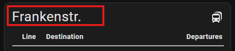

# Departures Card
A card to display departure times provided by [Departures](https://github.com/alex-jung/ha-departures) custom integration.

<p align="center">
  
</p>

## Installation
### Manual 

1. Download from last release `dist/ha-departures-car.js` file. 
2. Switch on `advanced mode`
3. Open `settings -> Dashboards` and click on tree dots in right upper corner
4. Click on `Ressourcen` and then on `Add Ressource` button
5. Add `local/ha-departures-card.js` as JS module
6. Refresh the page

### HACS
> Ongoing

## Using

Let's start adding a new card to dashboard.
``` yaml
type: custom:departures-card
```
The result should be an empty card in preview window like this:


### Card configuration

|yaml attribute                            |type    |required |default value              |
|------------------------------------------|--------|---------|---------------------------|
|type                                      |string  |Required |`custom:departures-card`   |
|[title](#card-title)                      |string  |Optional |empty                      |
|[icon](#card-icon)                        |string  |Optional |mdi:bus                    |
|[showTransportIcon](#show-transport-icon) |boolean |Optional |false                      |
|[showTimestamp](#show-timestamp)          |boolean |Optional |false                      |
|[showDelay](#show-delay)                  |boolean |Optional |false                      |

#### Card title

You may give your card a meaningsful name. It's done by setting `title` attribute:

``` yaml
type: custom:departures-card
title: Frankenstr.
```



#### Card icon

Optionaly we can set an icon for the card with `icon` attribute:

``` yaml
type: custom:departures-card
...
icon: mdi:bus-articulated-front
```
Result:


#### Entities

``` yaml
type: custom:departures-card
...
entities:
  - entity: sensor.nurnberg_frankenstr_bus_45_ziegelstein_u_mogeldorf
  - entity: sensor.nurnberg_frankenstr_tram_5_tiergarten
```


#### Show transport icon
With this attribute you can configure, whether the transpor icon is shown in line column or not

``` yaml
type: custom:departures-card
...
showTransportIcon: true
...
```

| showTransportIcon: `true`                   | showTransportIcon: `false`                     | 
|---------------------------------------------|------------------------------------------------|
|||

#### Show timestamp

The card currently supports two modes of showing the departure times.

- Show timestamp of next departure (`showTimestamp: true`)
- Show time delta to next departure (`showTimestamp: false`)

``` yaml
type: custom:departures-card
...
showTimestamp: true
...
```

| showTimestamp: `true`             | showTimestamp: `false`                         | 
|-----------------------------------|------------------------------------------------|
|  ||

#### Show delay

!!! warning
    This option will work only if endpoint provides real time information. Please s. [table](https://github.com/alex-jung/ha-departures/blob/master/README.md#supported-efa-endpoints)

``` yaml
type: custom:departures-card
...
showDelay: true
...
```

| showDelay: `true`             | showDelay: `false`                         | 
|-----------------------------------|------------------------------------------------|
|||

### Entity configuration

Each entity can be configured individually with following attributes:

|yaml attribute                        |type    |required |default value              |
|--------------------------------------|--------|---------|---------------------------|
|entity                                |string  |Required |empty                      |
|[destination_name](#destination-name) |string  |Optional |empty                      |
|[line_name](#line-name)               |string  |Optional |empty                      |
|[line_color](#line-color)             |boolean |Optional |emtpy                      |

#### Destination name
Per default the card uses name of departure provided by `departures` integration. This name can be overwritten by attribute `destination_name`

``` yaml
type: custom:departures-card
...
entities:
  - entity: sensor.nurnberg_frankenstr_bus_45_ziegelstein_u_mogeldorf
    destination_name: "Ziegelstein"
```

| destination_name: `empty`                        | destination_name: `"Ziegelstein"`        | 
|--------------------------------------------------|------------------------------------------|
|||

#### Line name

The name of line can be configured as well:

``` yaml
type: custom:departures-card
...
entities:
  - entity: sensor.nurnberg_frankenstr_bus_45_ziegelstein_u_mogeldorf
    line_name: "45"
```

| line_name: `empty`             | line_name: `"45"`                         | 
|-----------------------------------|------------------------------------------------|
|||

#### Line color

The attribute will change the background color of line:

``` yaml
type: custom:departures-card
...
entities:
  - entity: sensor.nurnberg_frankenstr_bus_45_ziegelstein_u_mogeldorf
    line_color: "#EB5A3C"

```

| line_color: `empty`               | line_name: `"#EB5A3C"`                            |
|-----------------------------------|---------------------------------------------------|
|||